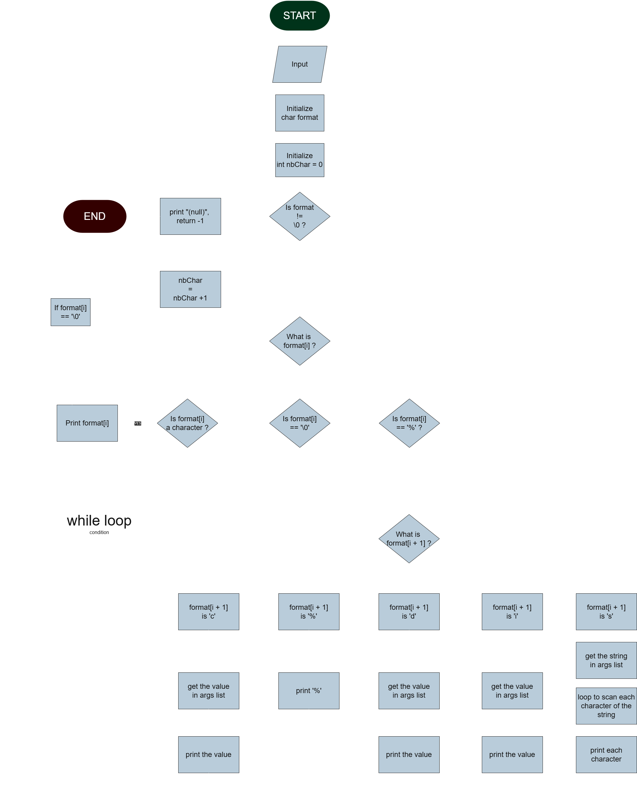

# holbertonschool-printf

- Description:
Recodage de la fonction printf (nommée ici _printf) en version simplifiée. La fonction printf affiche une sélection de caractères choisie par l'utilisateur, elle
- les lit,
- les compte,
- détecte les % et analyse le format d'affichage voulu par l'utilisateur (spécificateurs de conversion pris en charge: %c, %s, %d, %i, %%),
- appelle la bonne fonction puis affiche dans le format souhaité,
- retourne le nombre de caractères affichés.

Prototype : int _printf(const char *format, ...);

- Liste des fichiers :
      main.h
      man_3_printf
      _printf.c
      print_char.c
      print_string.c
      print_percent.c
      print_int.c

- Liste des fonctionnalités prises en charge:
  - %d : affiche un entier
  - %i : affiche un entier
  - %c : affiche un caractère
  - %s : affiche une chaîne de caractères
  - %% : affiche le caractère "%"
Les formats autres et non reconnus seront imprimés en l'état. Exemple: _printf("%r", var); -> "%r"

- Installation et compilation :
Aucune installation n'est nécessaire et l'intégralité du code et des documents annexes sont disponibles sur Github: https://github.com/AdeleM-prog/holbertonschool-printf.git.
Pour utiliser _printf par ailleurs, il est nécessaire d'inclure dans le header du projet : #include "main.h"
Compilation: 
gcc -Wall -Werror -Wextra -pedantic -std=gnu89 -Wno-format *.c
Tous les fichiers présents doivent être compilés ensemble pour le fonctionnement global de la fonction. 

- Utilisation
_printf affiche une sélection de caractères dont le contenu et le format sont choisis par l'utilisateur.
ex: _printf("Hello %s, %d !", World, 2026); -> "Hello world, 2026 !"
La fonction doit être saisie comme suit : _printf("texte et specificateur", var1, var2...);
Le spécificateur n°1 sera interprété avec la variable 1, le second spécificateur avec la variable 2, etc.

- Fonctionnalités
Prototype : int _printf(const char *format, ...);
La fonction _printf prend en argument une chaîne de caractères (format), et une liste inconnue d'autres arguments, et renvoie un entier.
Les spécificateurs de formats pris en charge sont: %c (pour les caractères simples), %s (pour les chaînes de caractères), %d et %i (pour les entiers), %% (pour afficher un "%").

Erreurs : En cas de spécificateur non reconnu, _printf l'affichera en l'état, pour éviter le crash de la fonction et éventuellement du programme. Par ex: _printf("%3d", var); -> "%3d". Si la sélection à imprimer est nulle (ex: _printf("");), la fonction renvoie -1 en signe d'erreur. En cas de %s NULL, la fonction affichera "(null)".

- Flowchart, fonctionnement interne

- Structure du projet

    - main.h: contient les prototypes et la structure
    - _printf.c: corps de la fonction, répartit le flux
    - print_char.c: détermine le comportement si %c
    - print_string.c: détermine le comportement si %s
    - print_percent.c: détermine le comportement si %%
    - print_int.c: détermine le comportement si %d ou %i

 - Exemples d'utilisation

_printf("Caractère: %c", 'A'); 
Affiche: Caractère: A

_printf("Chaîne de caractères: %s", "Hello World"); 
Affiche: Chaîne de caractères: Hello World

_printf("Entier: %d, %i", 2026, -2026); 
Affiche: Entier: 2026, -2026

_printf("Pourcentage: %%");
Affiche: Pourcentage: %

Auteurs:

Adèle MEGELINK
Laëtitia GRONDIN
